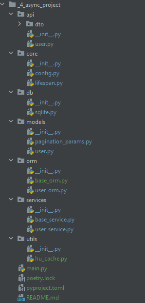

Вам нужно будет реализовать CRUD операции на FastAPI для User'ов с помощью Вашей ORM:
- GET /users/ - методов select, возвращающий всех пользователей
- POST /users/ - метод insert, создание пользователя
- PUT /users/<id:int> - метод update_by_id, обновление пользователя по id
- DELETE /users/ - метод delete_by_id, удаление пользователя по id

Структуру советуем использовать следующую:
